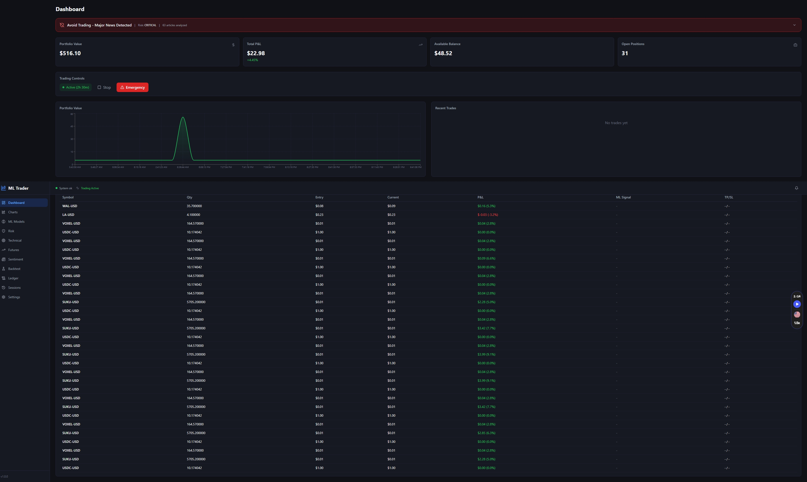
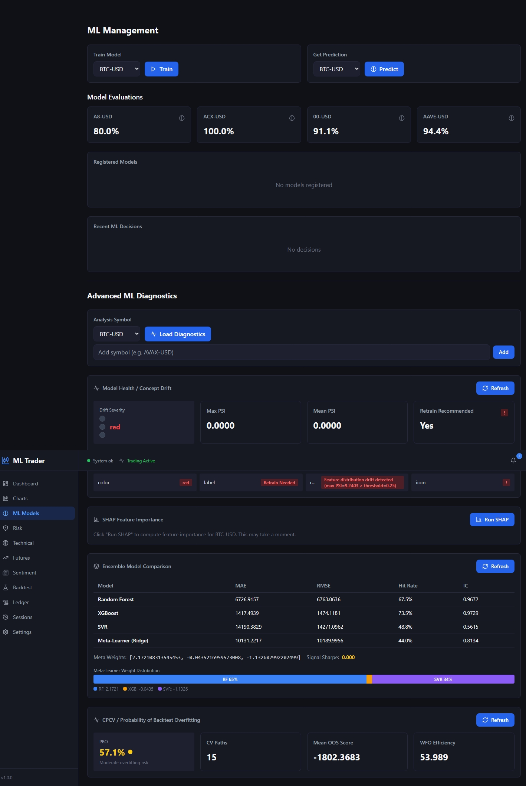
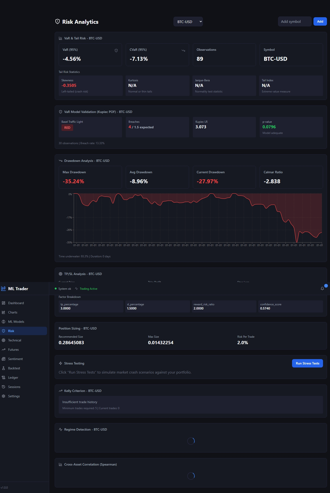
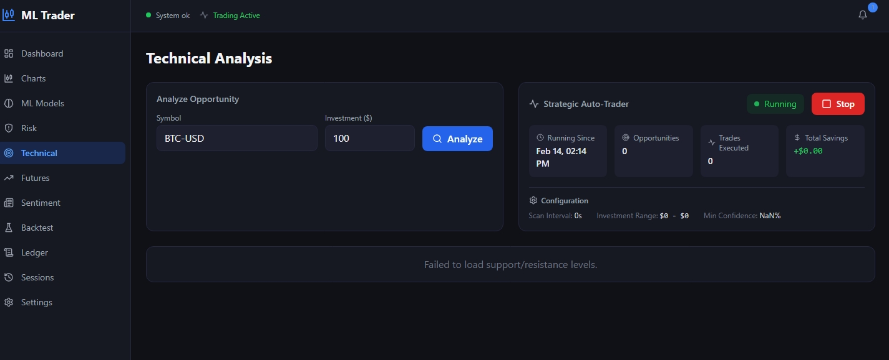
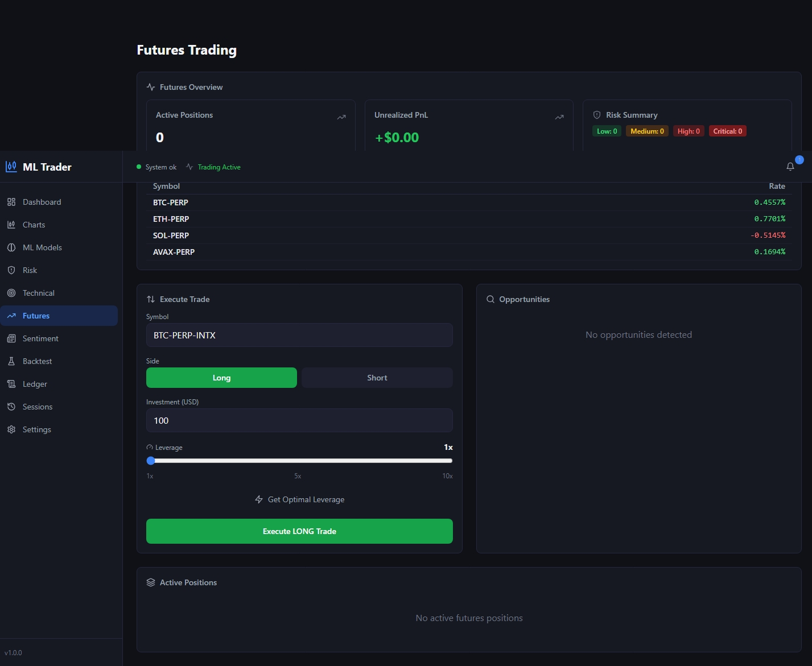
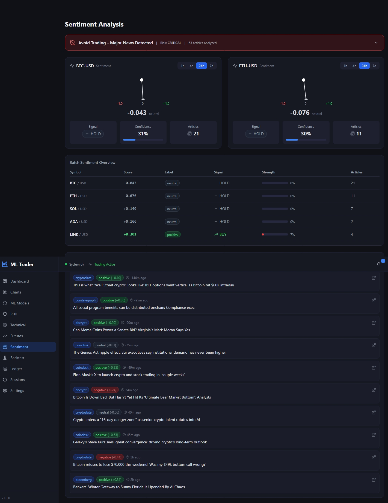
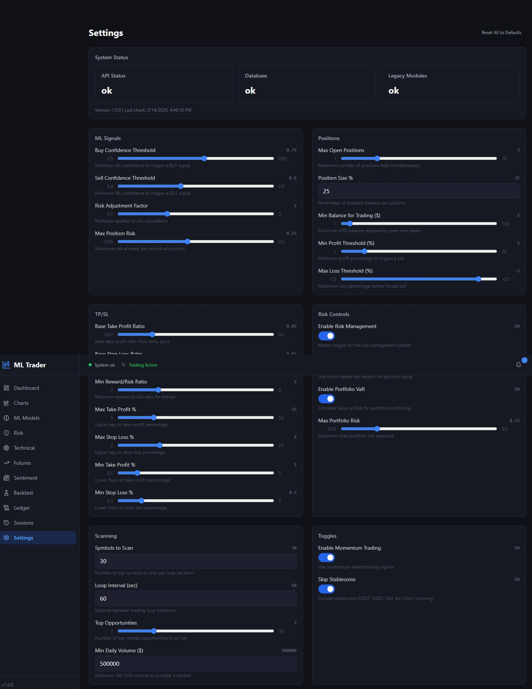

<div align="center">

# Coinbase ML Trading Platform

### Autonomous Cryptocurrency Trading System Powered by Machine Learning


An end-to-end ML trading platform that scans **370+ cryptocurrency pairs** on Coinbase, predicts price direction with a **stacking ensemble**, manages risk with **GARCH-calibrated stops**, and executes trades autonomously -- all through a real-time **11-page React dashboard**.

**Sineshaw (Shaw) Mesfin Tesfaye** | BS Computer Science, Georgia State University

[Read the Research Paper (PDF)](Advanced%20Modular%20Cryptocurrency%20Trading%20%26%20Analytics%20Platform%3A%20A%20Comprehensive%20Mathematical%20and%20Implementation%20Framework.pdf)

</div>

---

## Project Overview

This platform was designed and built from scratch as a graduate research project. It combines **machine learning**, **quantitative finance**, and **full-stack web development** into a single production-grade system that connects to the Coinbase Advanced Trade API for live autonomous trading.

The system is **not a toy or prototype** -- it runs against real market data, executes real trades, and implements institutional-grade risk controls including Value-at-Risk, GARCH volatility modeling, and Kelly Criterion position sizing.

### What I Built

- A **stacking ML ensemble** (RandomForest + XGBoost + SVR -> Ridge meta-learner) that achieves 62.3% directional accuracy and F1 >= 0.90 on 86% of symbols
- A **technical analysis engine** with automated support/resistance detection, Fibonacci retracement, and volume profile analysis
- A **futures trading engine** with GARCH-informed dynamic leverage calculation
- A **sentiment analyzer** combining NLP news scoring with price/volume crisis detection
- A **quantitative backtesting engine** with Monte Carlo simulation, walk-forward validation, and toggleable live-system feature matching
- A **risk management framework** implementing VaR, factor models, liquidity risk, and regime-adaptive TP/SL
- A **React + TypeScript dashboard** with 11 pages, real-time WebSocket data, and interactive charts
- A **FastAPI backend** with 17 REST endpoints bridging the ML engine to the frontend
- A **2,100+ line research paper** with full mathematical derivations and statistical validation
- **263 automated tests** across 11 test modules

---

## Dashboard Screenshots

### Portfolio Dashboard
Real-time portfolio value, open positions, P&L tracking, and recent trade feed.


### Trading Charts
Interactive candlestick charts with MACD, RSI, Bollinger Bands, volume, and order book depth overlays.



### Backtesting Engine
Run strategy backtests with toggleable S/R levels, futures leverage, and sentiment filtering. Includes equity curves, Monte Carlo fan charts, and benchmark comparisons.


### ML Model Management
Train and evaluate the stacking ensemble, view SHAP feature importance, and monitor ensemble diagnostics and drift detection.



### Risk Analytics
Value-at-Risk breakdown, factor exposures, liquidity risk assessment, and forecast uncertainty bands.



### Technical Analysis
Automated support/resistance levels, Fibonacci retracement overlays, volume profile, and chart pattern scanner.



### Futures Trading
Dynamic leverage calculator, margin analysis, funding rate tracking, and liquidation risk monitoring.



### Sentiment Analysis
News sentiment scoring dashboard, market condition indicators, and crisis detection alerts.



### Settings
System configuration, trading parameters, and API connection management.



---

## Architecture

```
                         Coinbase Advanced Trade API
                          (REST + WebSocket Feeds)
                                    |
              +---------------------+---------------------+
              |                     |                     |
       Data Ingestion        Technical Analysis     Sentiment Analyzer
       (370+ symbols)         (S/R + Fibonacci)      (NLP + Crisis)
              |                     |                     |
              +---------------------+---------------------+
                                    |
                         Feature Engineering
                      (14 indicators + 35 alphas)
                                    |
                        Stacking ML Ensemble
                      (RF + XGBoost + SVR -> Ridge)
                                    |
                   +----------------+----------------+
                   |                |                |
            Risk Management   Futures Engine   Order Execution
            (VaR / GARCH /    (Dynamic         (TP/SL Mgmt /
             Kelly / Factor)   Leverage)        Coinbase API)
                   |                |                |
                   +----------------+----------------+
                                    |
                           SQLite Database
                                    |
                   +----------------+----------------+
                   |                                 |
           FastAPI Backend                  React 18 + TypeScript
            (17 endpoints)                   Frontend (11 pages)
```

---

## ML Pipeline

The prediction engine uses a **two-layer stacking ensemble** trained with time-series-aware cross-validation to prevent look-ahead bias:

| Layer | Models | Role |
|:---|:---|:---|
| **Base Learners** | RandomForest (500 trees), XGBoost (500 rounds), SVR (RBF kernel) | Generate diverse out-of-fold predictions |
| **Meta-Learner** | Ridge Regression (L2) | Optimally combines base predictions into final expected return |

**Signal logic:** Expected return > +0.1% = BUY, < -0.1% = SELL, else HOLD. Signals require >= 60% model agreement confidence to act.

**Features:** 14 core technical indicators (EMA, MACD, RSI, Bollinger, Stochastic, ATR, OBV), plus 35+ WorldQuant-style alpha factors and up to 225+ features in the unified system.

---

## Quantitative Methods

| Method | What It Does |
|:---|:---|
| **GARCH(1,1)** | Forecasts conditional volatility for TP/SL calibration and regime detection |
| **Hidden Markov Models** | Identifies market regimes (bull / bear / sideways) to adapt strategy behavior |
| **Copula Models** | Models non-linear cross-asset dependencies (Gaussian, Student-t, Archimedean) |
| **Heston Stochastic Volatility** | Models volatility as a stochastic process for options-aware risk |
| **Black-Litterman** | Combines market equilibrium with ML views for portfolio optimization |
| **Extreme Value Theory** | Models tail risk for drawdown and worst-case estimation |
| **Kalman Filter** | Denoises crypto price signals for cleaner ML inputs |
| **Wavelet Transform** | Decomposes price into multi-scale trend + noise components |
| **Kelly Criterion** | Computes mathematically optimal position size (half-Kelly for safety) |
| **Monte Carlo Simulation** | Bootstrap resampling across 10,000 paths for strategy confidence intervals |
| **Walk-Forward Validation** | Expanding-window cross-validation that simulates real deployment |

---

## Risk Management

| Layer | Implementation |
|:---|:---|
| **Position Sizing** | Kelly criterion blended with volatility-adjusted allocation (70/30 conservative/aggressive) |
| **Take-Profit / Stop-Loss** | ATR-based, regime-dependent: low vol +3%/-1%, medium +5%/-2%, high +8%/-4%, minimum 2:1 reward:risk |
| **Portfolio VaR** | Parametric + Historical + Component VaR at 95% confidence with Expected Shortfall |
| **Factor Risk** | Multi-factor decomposition across beta, sector, and momentum exposures |
| **Liquidity Risk** | Real-time spread, order book depth, and crowding analysis |
| **Per-Trade Limits** | 1% of account max risk per trade, 20% max single position |

---

## Performance Results

From live production and backtesting (February 2026):

| Metric | Value |
|:---|:---|
| Directional Accuracy | 62.3% across 60 symbols |
| F1 Score >= 0.90 | 86% of evaluated symbols |
| Backtest Sharpe Ratio (ML strategy) | 5.19 |
| Backtest Max Drawdown (ML strategy) | 1.82% |
| Win Rate | 62.7% |
| Symbols Scanned Per Cycle | 370+ |
| Signal-to-Fill Latency | < 500ms |
| Test Coverage | 263 tests, 11 modules |

---

## Tech Stack

| Layer | Technologies |
|:---|:---|
| **ML / Quant** | scikit-learn, XGBoost, arch (GARCH), statsmodels, scipy, PyWavelets, pykalman |
| **Backend** | Python 3.10+, FastAPI, Flask/Dash, SQLite, SQLAlchemy, Uvicorn |
| **Frontend** | React 18, TypeScript, Vite, TailwindCSS, Recharts, Lightweight Charts, TanStack Query |
| **Infrastructure** | Coinbase Advanced Trade API, WebSocket, JWT Authentication, Docker, pytest |

---

## Project Scale

| | |
|:---|---:|
| Core Python modules | 42 |
| Frontend pages | 11 |
| REST API endpoints | 17 |
| Automated tests | 263 |
| Engineered ML features | 225+ |
| WorldQuant-style alpha factors | 35+ |
| Research paper length | 2,100+ lines (LaTeX) |
| Supported trading pairs | 370+ |

---

## Research Paper

The full research paper is included in this repository as a PDF. It covers:

- Mathematical derivations for all ML models, ensemble methods, and risk metrics
- Empirical evaluation across 60 cryptocurrency symbols with statistical significance tests
- Walk-forward validation, Kupiec VaR backtesting, and Christoffersen conditional coverage tests
- Comparison with published benchmarks from the financial ML literature
- Documentation of all three new trading subsystems and enhanced backtesting methodology

[Read the Paper (PDF)](Advanced%20Modular%20Cryptocurrency%20Trading%20%26%20Analytics%20Platform%3A%20A%20Comprehensive%20Mathematical%20and%20Implementation%20Framework.pdf)

---

## License

See [LICENSE](LICENSE) for details.

---

<div align="center">

**Sineshaw (Shaw) Mesfin Tesfaye** | Georgia State University, Department of Computer Science

</div>
